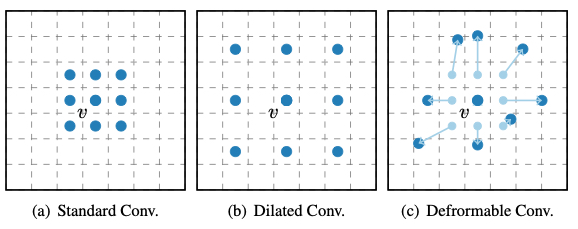
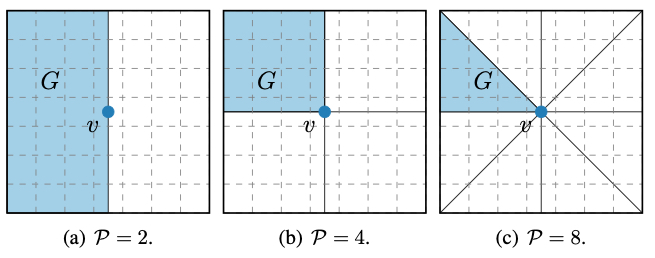
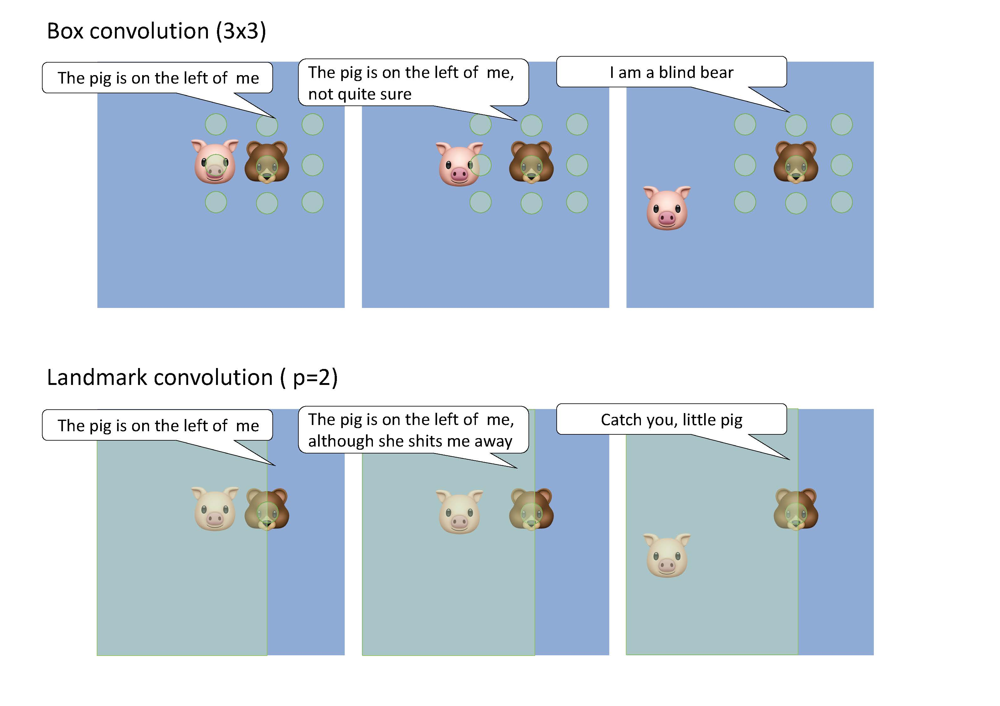
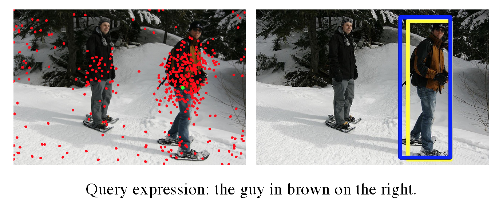

# LandmarkConv
Landmark Feature Convolutional Networks

This repo aims to learning convolutional features *outside the box*.

### What's the difference?

<!-- #### Box convolution-->
**Box convolution**
 

1. Standard conv has a quite limited receptive field. 
2. Dilated conv enlarges the receptive field without introducing extra paramter, but leads to many holes.
3. Deformvable conv make the receptive field more flexible by adding learnable offsets. However, the receptive filed is still box-like since the learned offsets are usually small.

**Landmark convolution**
 

1. While box conv updates representations with neighboring *points*, we update representation with neighboring *regions*, which are extracted with a *permutation* invariant function. 

2. We part the whole image into several intervals according to the given "kernel size" (number of intervals).

3. The landmark conv also enlarges the receptive filed without introducing extra paramter.
----------------------------------------------------------------
### What's the possible advantage of landmark conv compared to box convs?
1. Spatial robustness
2. Long range information modeling

<!-- a very simple case here  -->
To understand, here is a very simple example (though not restrictly)
<!-- The landmark conv can generate equivalent  -->
 

The landmark conv tends to generate equivalent representation if the they have the same spatial relationships. 🐷💗🐻

Visualization in natural image. 

 

----------------------------------------------------------------

### Installation
#### requirements
- Linux with Python 3.6
- CUDA support 
- gcc 4.9 or above

```bash
# git clone git://github.com/hbb1/landmarkconv
cd lanmarkconv/lib/layers
make
```

### Usage
For convenience, LandmarkConvs are implemented as subclass of torch.nn.Conv2D, so just use it like standard convolution in Pytorch.

```Python
from .lib.layers.conv4 import PConv2d4
from .lib.layers.conv8 import PConv2d8
```


--------------------

### TODO

- [x] Performance on visual grounding (image), see [LBYLNet](https://github.com/svip-lab/LBYLNet.git)
- [ ] Visual grounding in other domain (video, 3D, RGBD).
- [ ] Object detection and semantic segmentation and so on.


----------------------------------------------------------------
### Citation
The convolution is first proposed in this paper, if you find it helpful in your research, please cite our paper.

```
@InProceedings{huang2021look,
      title={Look Before You Leap: Learning Landmark Features for One-Stage Visual Grounding}, 
      author={Huang, Binbin and Lian, Dongze and Luo, Weixin and Gao, Shenghua},
      booktitle={IEEE/CVF Conference on Computer Vision and Pattern Recognition (CVPR)},
      month = {June},
      year={2021},
}
```